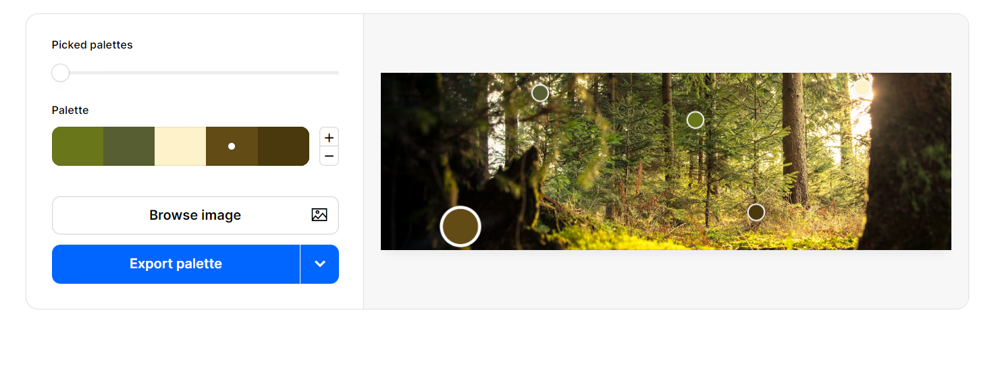
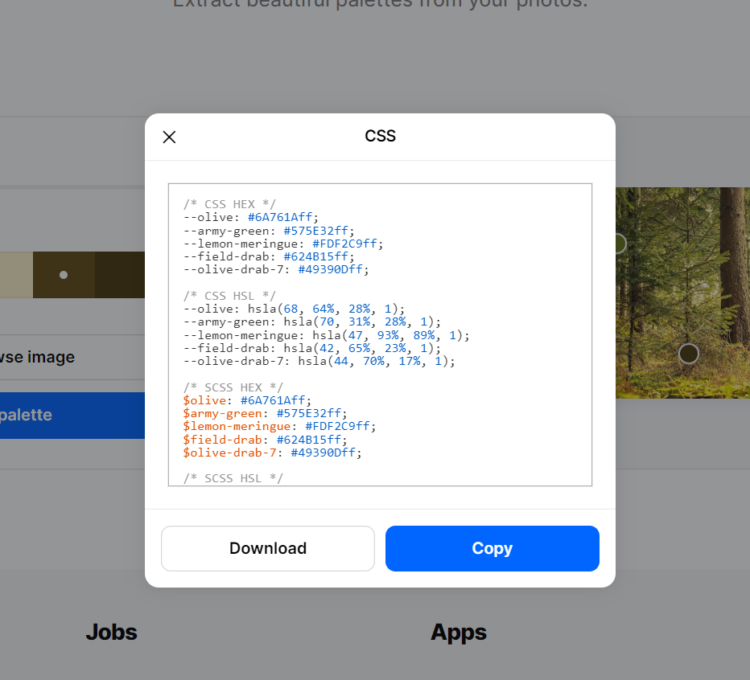

# **Bear Minimum**
## **Site Overview**
Bear Minimum is an info-tainment (information/entertainment) website educating users on sustainability. The main aim of the website is provide useful advice and information about ways to slowly create a sustainable lifestyle in modern society as well as encourage users to 'get back to nature'. There's very little out there about general encouragement to lead a slightly more sustainible life, a lot of the media around being environmentally friendly is 100% effort or nothing. This website is trying to bridge this gap and create a more positive outlook on both sustainibility and Climate Change. 

## Table of Contents:
1. [**Site Overview**](#site-overview)
1. [**Planning**](#planning)
    * [***Audiences***](#audiences)
    * [***Users***](#users)
    * [***Aims***](#aims)
    * [***How To Achieve***](#how-to-achieve)
    * [***Wireframes***](#wireframes)
        * [*Desktop*](#Desktop)
        * [*Mobile*](#Moblile)
    * [***Design***](#design)
        * [*Color Scheme*](#color-scheme)
        * [*Typography*](#typography)
1. [**Universal Features**](#universal-features)
    * [***Header Element***](#header-element)
        * [*Title*](#title)
        * [*Logo*](#logos)
        * [*Nav Bar*](#nav-bar)
    * [***Hero Image***](#hero-image)
    * [***Anchor Tags***](#anchor-tags)
    * [***Footer***](#footer)
1. [**Page Content Features**](#page-content-features)
    * [***About Content***](#about-page-content)
    * [***Blog Page Content***](#blog-page-content)
    * [***Sign up Page Content***](#fsign-up-page-content)
1. [**Future Improvements**](#future-improvements)
1. [**Testing**](#testing)
1. [**Deployment**](#deployment)
1. [**Credits**](#credits)
    * [***References***](#references)
    * [***Content***](#content)
    * [***Media***](#media)

## **Planning**
### **Audiences**
### **Users**
### **Aims**
### **How to Achieve**
### **Wireframes**
#### *Desktop*
#### *Mobile*
### **Design**
#### *Color Scheme*
* Having already chosen the Hero/Main image for the Home page I wanted to pick a color pallette that would tie in cohesivly with the image (which would be used universally around the site). I knew that coolors.co had a image color extraction which could pick out the exact colors that would work to this effect. The effect I wanted to pull off was natural, elegant and calming. The Visual Identity of this website should give the user a calm, relaxed feeling. No overly bright or neon colors. 

* I also knew that coolors.co gave you all the HEX, rbga and HSL codes ready to copy and paste for the colors picked.

#### *Typography*

## **Universal Features**
### **Header Element**
#### *Title*
#### *Logo*
#### *Nav Bar*
### **Hero Image**
* For the Hero Image for this project I decided on a nature theme. I chose the Hero Image before deciding on fonts and color schemes, as I wanted to make them both cohesive with the Hero Image. The Hero Image will be used throughout the webpages to add a layer of continunity. The first image I chose from Pexels was too large and was distorted when pushed through. So I read up on best practices for webpage/desktop and found a helpful blog post from Hubspot: "Ultimate Guide to Hero Images [Best Practices + Examples]". I found an appropriate image that then i used to create a color scheme which is described above. 

***ADD SCREENSHOT HERE
This image is of a forest dappled with sunlight.
### **Anchor Tags**
### **Footer**

## **Page Content Features**
### **About Content**
### **Blog Page Content**
### **Sign up Page Content**

## **Future Improvements**

## **Testing**

## **Deployment**

## **Credits**
### **References**
* Whilst I did try to deviate as much as possible, this project was very influenced by CI’s Love Running Project. Notable similarities are the use of Hero-Images, the Social Media Footer and the style of the Nav Bar. 
* I would also like to mention that, before starting this project, I did pursue other CI student’s projects, for both code inspiration and direction. Whilst no code was directly taken from these other projects, I can say that my research did influence how I built the project initially. (Notable mentions: David Bowers github: dnlbowers, who BLAH BLAH BLAH)
### **Content**
### **Media**
