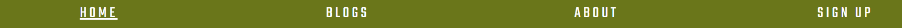
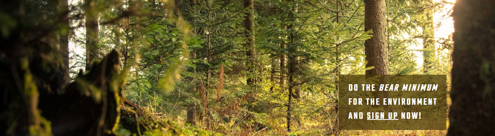

# **Bear Minimum**
## **Site Overview**
Bear Minimum is an info-tainment (information/entertainment) website educating users on sustainability. The main aim of the website is provide useful advice and information about ways to slowly create a sustainable lifestyle in modern society as well as encourage users to 'get back to nature'. There's very little out there about general encouragement to lead a slightly more sustainible life, a lot of the media around being environmentally friendly is 100% effort or nothing. This website is trying to bridge this gap and create a more positive outlook on both sustainibility and Climate Change. 

## Table of Contents:
1. [**Site Overview**](#site-overview)
1. [**Planning**](#planning)
    * [***Audiences***](#audiences)
    * [***Users***](#users)
    * [***Aims***](#aims)
    * [***How To Achieve***](#how-to-achieve)
    * [***Wireframes***](#wireframes)
        * [*Desktop*](#Desktop)
        * [*Mobile*](#Moblile)
    * [***Design***](#design)
        * [*Color Scheme*](#color-scheme)
        * [*Typography*](#typography)
1. [**Universal Features**](#universal-features)
    * [***Header Element***](#header-element)
        * [*Logo*](#logos)
        * [*Nav Bar*](#nav-bar)
    * [***Hero Image***](#hero-image)
    * [***Anchor Tags***](#anchor-tags)
    * [***Footer***](#footer)
1. [**Page Content Features**](#page-content-features)
    * [***About Content***](#about-page-content)
    * [***Blog Page Content***](#blog-page-content)
    * [***Sign up Page Content***](#fsign-up-page-content)
1. [**Future Improvements**](#future-improvements)
1. [**Credits**](#credits)
    * [***References***](#references)
    * [***Content***](#content)
    * [***Media***](#media)

## Testing:
1. [***During Development Testing***](#during-development-testing)
    * [**Manual Testing**](#manual-testing)
    * [**Bugs and Fixes**](#bugs-and-fixes)
1. [**Post Development Testing**](#post-development-testing)
    * [**Validators**](#validators)
      * [*HTML*](#html---httpsvalidatorw3orgnu)
      * [*CSS*](#css---httpsjigsaww3orgcss-validator)
    * [**Lighthouse Scores**](#lighthouse-scores)
      * [*Desktop Version:*](#desktop-version)
      * [*Mobile Version*](#mobile-version)
      * [*Lighthouse Score*](#lighthouse-score)
    * [**Accessability**](#accessability)
1. [**Deployment**](#deployment)

## **Planning**
### **Audiences**
### **Users**
### **Aims**
### **How to Achieve**
### **Wireframes**
#### *Desktop*
#### *Mobile*
### **Design**
#### *Color Scheme*
* Having already chosen the Hero/Main image for the Home page I wanted to pick a color pallette that would tie in cohesivly with the image (which would be used universally around the site). I knew that coolors.co had a image color extraction which could pick out the exact colors that would work to this effect. The effect I wanted to pull off was natural, elegant and calming. The Visual Identity of this website should give the user a calm, relaxed feeling. No overly bright or neon colors. 

* I also knew that coolors.co gave you all the HEX, rbga and HSL codes ready to copy and paste for the colors picked. By consolidating each branding asset (images, colors, fonts) into a cohesive aesthetic, this develops brand recognition, which in turn is good UX.

#### *Typography*
* Whilst doing research into the best Google Font combinations, I came across this article: [21 Google Fonts Combinations For Websites & Brands](https://www.garett.co/21-google-fonts-combinations-for-websites-brands). The Teko + Montserrat combination seemed to be the best suited to the aesthetic of the page. Plus their readability is very good, so this is a plus for the accessibility of the website.

## **Universal Features**
### **Header Element**
#### *Logo*
* The website logo is strong and minimalistic, to fit in with the core values of the website. 
* The logo will appear on every webpage for continuity.
* The logo is strongly presented and at the top center of the page so the user's eye naturally goes down the center of the page, where most of the information will be held.
#### *Nav Bar*
* I wanted to add a traditional Navigation bar at the top of my website so the user could easily get from one page to another. 
* The navigation bar appears on all the pages, including the Sign Up form feedback page.
* It contains links to the Home, About, Blogs, and Sign Up pages to allow easy navigation around the website.
* The below image shows the user's current page highlighted using white underline, this is a subtle addition trying to make the users experinces as calm and enjoyable as possible.
* The hover feature was employed to turn the lettering from white to black to make sure the user is aware that this is an active link which they can click.

### **Hero Image**
* For the Hero Image for this project I decided on a nature theme. I chose the Hero Image before deciding on fonts and color schemes, as I wanted to make them both cohesive with the Hero Image. The Hero Image will be used throughout the webpages to add a layer of continunity. The first image I chose from Pexels was too large and was distorted when pushed through. So I read up on best practices for webpage/desktop and found a helpful blog post from Hubspot: "Ultimate Guide to Hero Images [Best Practices + Examples]". I found an appropriate image that then i used to create a color scheme which is described above. 
* I also employed the zoom effect to the main image. Again this was inspired by the Love Running Project, as i liked the effect it had for the User's Experience.

* This image is of a forest dappled with sunlight.
* The idea for the Hero Image with the floating CTA was directly inspired by the Love Running Project. However the code was adapted quite a bit for this website, also the user's experience of this is a Call to Action, rather than infomation. It also serves to give the user the explicit subject matter of the site - the site aim is directly stated.
### **Anchor Tags**
### **Footer**

## **Page Content Features**
### **About Content**
### **Blog Page Content**
### **Sign up Page Content**

## **Future Improvements**

## **Deployment**

## **Credits**
### **References**
* Whilst I did try to deviate as much as possible, this project was very influenced by CI’s Love Running Project. Notable similarities are the use of Hero-Images and floated text on top of the Hero-Image, as well as the Social Media icons in the Footer. 
* I would also like to mention that, before starting this project, I did peruse other CI student’s projects, for both code inspiration and direction. Whilst no code was directly taken from these other projects, I can say that my research did influence how I built the project and create my README.md initially - strong deviations were taken after my research and the inital build. (Notable mentions: David Bowers github: dnlbowers, who I asked permission to do this.)
* I did rely on stack overflow, W3schools, and MDN web docs for general references and problem solving throughout the project.
### **Content**
### **Media**
