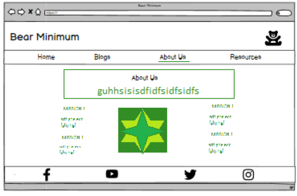

# **Bear Minimum**
## **Site Overview**
Bear Minimum is an info-tainment (information/entertainment) website educating users on sustainability. The main aim of the website is provide useful advice and information about ways to slowly create a sustainable lifestyle in modern society as well as encourage users to 'get back to nature'. There's very little out there about general encouragement to lead a slightly more sustainable life, a lot of the media around being environmentally friendly is 100% effort or nothing. This website is trying to bridge this gap and create a more positive outlook on both sustainability and Climate Change. (*Some of the images used in this README.md are slightly out of date and the areas have been since modified - however these changes are minor enough not to warrant new screenshots)

## Table of Contents:
1. [**Site Overview**](#site-overview)
1. [**Planning**](#planning)
    * [***Audiences***](#audiences)
    * [***Users***](#users)
    * [***Aims***](#aims)
    * [***How To Achieve***](#how-to-achieve)
    * [***Wireframes***](#wireframes)
        * [*Desktop*](#Desktop)
        * [*Mobile*](#Moblile)
    * [***Design***](#design)
        * [*Color Scheme*](#color-scheme)
        * [*Typography*](#typography)
1. [**Universal Features**](#universal-features)
    * [***Header Element***](#header-element)
        * [*Logo*](#logos)
        * [*Nav Bar*](#nav-bar)
    * [***Hero Image***](#hero-image)
    * [***Footer***](#footer)
1. [**Page Content Features**](#page-content-features)
    * [***About Content***](#about-page-content)
    * [***Blog Page Content***](#blog-page-content)
    * [***Sign up Page Content***](#fsign-up-page-content)
1. [**Future Improvements**](#future-improvements)
1. [**Credits**](#credits)
    * [***References***](#references)
    * [***Content***](#content)
    * [***Media***](#media)
## Testing:
1. [***During Development Testing***](#during-development-testing)
    * [**Manual Testing**](#manual-testing)
    * [**Bugs and Fixes**](#bugs-and-fixes)
1. [**Post Development Testing**](#post-development-testing)
    * [**Validators**](#validators)
      * [*HTML*](#html---httpsvalidatorw3orgnu)
      * [*CSS*](#css---httpsjigsaww3orgcss-validator)
    * [**Lighthouse Scores**](#lighthouse-scores)
      * [*Desktop Version:*](#desktop-version)
      * [*Mobile Version*](#mobile-version)
      * [*Lighthouse Score*](#lighthouse-score)
    * [**Accessability**](#accessability)
1. [**Deployment**](#deployment)

## **Planning**
### **Target Audiences:**
* Users craving to be reunited with nature and get out of the modern-world rush. 
* Users with a general interest in environmentalism and want to learn more.
* Users who have begun their sustainability journey but would like to find more information on the how to build the lifestyle with small steps.
### **User Stories:**
* As a user, I want to see the subject matter of the page.
* As a user, I want to be able to navigate the site to find what I require quickly and easily.
* As a user, I want to leave feeling as I know morse about the subject than when I am entering.
* As a user, I want to be able to navigate my way to resources easily.
* As a user, I want to feel calm and happy whilst navigating the site.
* As a user, I want to understand the Mission of the site quickly.
### **Aims:**
* To educate the user on the Environmentalism and Sustainability.
* To offer the user a chance to make small steps towards and/or build an eco-friendlier lifestyle.
* Provide the user with the information required on the Mission of the site.
* Provide the use a way to subscribe to a newsletter.
### **How to Achieve:**
* The site will provide multiple free resources such as 
    * Info-tainment blog posts
    * An embedded Spotify podcasts.
    * A way to stay informed with the newsletter sign up.
### **Wireframes**
* Below are some screengrabs of the desktop and mobile wireframes made for this project.
* Some notable changes and differences - the resource page was dropped in favour of a sign-up page. The newsletter and driving users back to the site fit in more with the aims than a new page for additional resources. Especially when I found a way to fit some extra resources into the blog page.
* Another change has been made to the home page - instead of several columns for the content Instead went for a singular column for all three blog posts. I think this is a cleaner look and less distracting to the user's eye. 
#### *Desktop*

#### *Mobile*

### **Design**
#### *Color Scheme*
* Having already chosen the Hero/Main image for the home page I wanted to pick a color palette that would tie in cohesively with the image (which would be used universally around the site). I knew that coolors.co had an image color extraction which could pick out the exact colors that would work to this effect. The effect I wanted to pull off was natural, elegant and calming. The Visual Identity of this website should give the user a calm, relaxed feeling. No overly bright or neon colors. 

* I also knew that coolors.co gave you all the HEX, rbga and HSL codes ready to copy and paste for the colors picked. By consolidating each branding asset (images, colors, fonts) into a cohesive aesthetic, this develops brand recognition, which in turn is good UX.

#### *Typography*
* Whilst doing research into the best Google Font combinations, I came across this article: [21 Google Fonts Combinations For Websites & Brands](https://www.garett.co/21-google-fonts-combinations-for-websites-brands). The Teko + Montserrat combination seemed to be the best suited to the aesthetic of the page. Plus, their readability is very good, so this is a plus for the accessibility of the website.
## **Universal Features**
### **Header Element**
#### *Logo*
* The website logo is strong and minimalistic, to fit in with the core values of the website. 
* The logo will appear on every webpage for continuity.
* The logo is strongly presented and at the top center of the page so the user's eye naturally goes down the center of the page, where most of the information will be held.
#### *Nav Bar*
* I wanted to add a traditional Navigation bar at the top of my website so the user could easily get from one page to another. 
* The navigation bar appears on all the pages, including the Sign-Up form feedback page.
* It contains links to the Home, About, Blogs, and Sign-Up pages to allow easy navigation around the website.
* The below image shows the user's current page highlighted using white underline, this is a subtle addition trying to make the users experiences as calm and enjoyable as possible.
* The hover feature was employed to turn the lettering from white to black to make sure the user is aware that this is an active link which they can click.

### **Hero Image**
* For the Hero Image for this project I decided on a nature theme. I chose the Hero Image before deciding on fonts and color schemes, as I wanted to make them both cohesive with the Hero Image. The Hero Image will be used throughout the webpages to add a layer of continuity. The first image I chose from Pexels was too large and was distorted when pushed through. So, I read up on best practices for webpage/desktop and found a helpful blog post from HubSpot: "Ultimate Guide to Hero Images [Best Practices + Examples]". I found an appropriate image that then I used to create a color scheme which is described above. 
* I also employed the zoom effect to the main image. Again, this was inspired by the Love Running Project, as I liked the effect it had for the User's Experience.

* This image is of a forest dappled with sunlight.
* The idea for the Hero Image with the floating CTA was directly inspired by the Love Running Project. However, the code was adapted quite a bit for this website, also the user's experience of this is a Call to Action, rather than information. It also serves to give the user the explicit subject matter of the site - the site aim is directly stated.
### **Footer**
* For good UX I kept with a traditional website footer of social media links. This is clean and simple and is universal throughout the website. Again, the feeling of this site should be calm and serene, this pared down footer is a key part of the continuity of the website.
* I also added the site's philosophy as a quote to the footer - to maintain the user's understanding of the site's aims.
* There is also a copyright - because I liked the addition.

## **Page Content Features**
### **About Content**
* The about content needed to be simple. The messaging very easy to absorb and the mission of the site clear. To do this, I adapted a Love Running bit of code to fit my purpose. Although this was not as creative as I would have liked the end result does speak for itself and the overall feel of the about page, I think really suits the end goal of the site. It is clear, calm and direct. 

* I also reused the 'second call to action' to push the site's main aim of newsletter sign up. This is something that appears in everything bar the blog page and the sign-up page itself.
### **Blog Page Content**
* For the Blog page content, I wanted to incorporate different mediums. In the future this would look like Videos, Podcasts, eBooks and Blogs. But for now, it's just blogs and podcasts,
* The three blogs were taken from other creators (references in the credits section). They were chosen for their value as 'info-tainment' and their suitability for the mission of the website. Instructional ways to slowly become in tune with nature and make small steps towards a lower individual environmental impact.
* Wanted to link the blogs back to their way the user saw the blog teasers on the home page. So employed either similar images or the same images in larger forms to be used as page breaks. Example below:

* The blogs are in a typical newspaper fashion, one column, justified paragraphs with centred headers and left-aligned sub-heading. This is a style of blog known to many users and to break away from user experience in this case would have become a distraction to the user rather than help them focus on the content and stay calm and serene - which is one of the site's aims.
* I chose the grid display for the podcast section because it is naturally responsive and looks sleek and elegant. It also distracts the user's eye less than large blocks.

### **Sign up Page Content**
* For the Sign-Up page I wanted to keep the devices clear of distraction. To convey a calm, modern and sleek look the only thing available on this page is the sign up.
* The entire mission for this website is to create return users to consume more content. The Newsletter is the main way the site gets return users.
* Because of the lack of content and the simplified nature of the form - it needed to take center stage. So, the form is in the middle of the page. 
* The only options the users have are to click off the page to social media, click within the site or sign up. This simplified user experience will lead to less click off. Trying not to overload the user with too many choices creates the calm user experience this website is trying to produce.

## **Future Improvements**
* Something I did want to do but would have been too time consuming to do was to make the blog section into several carousels with different headings/genres.
* Sign Up page could be GET, and the user could be sent to an internal page rather than the regular POST system.
* I would also make sure that in future blog posts would be continually added, as well as other types of media, such as a shortform video page from content creators that focus on Environmentalism.
* Another improvement would have other pages linking out both live community events and even a map of zero-waste shops in the area where the user is.
* One more would be live updates to new Spotify podcasts by an affiliated podcast AND/OR other trustworthy creators.
* Links to further free resources via other environmental sites such as The Eden Project, National Parks website etc. 
## **Credits**
### **References**
* Whilst I did try to deviate as much as possible, this project was influenced by CI’s Love Running Project. Notable similarities are the use of Hero-Images and floated text on top of the Hero-Image, the Missions section in the About Pag is also influenced by the project. 
* I would also like to mention that, before starting this project, I did peruse other CI student’s projects, for both code inspiration and direction. Whilst no code was directly taken from these other projects, I can say that my research did influence how I built the project and created my README.md initially - strong deviations were taken after my research and the initial build. (Notable mentions: David Bowers GitHub: dnlbowers, who I asked permission to do this.)
* I did rely on stack overflow, W3schools, CSS-TRICKS and MDN web docs for general references and problem solving throughout the project.
### **Content**
* Content for the Wildflower blog is taken from the book "The Wild Handbook: Seasonal Activities to Help You Reconnect with Nature" By Emily Thomas and James Weston Lewis. 
* Blog post How Nature Can Help Heal Our Planet was taken from The Nature Conservancy: https://www.nature.org/en-us/what-we-do/our-priorities/tackle-climate-change/climate-change-stories/how-nature-can-help-heal-our-planet/
* Blog post 5 Ways to Start Being More Sustainable was taken from Intelligent Change https://www.intelligentchange.com/blogs/read/5-ways-to-start-being-more-sustainable
* The Spotify Podcasts are all embedded links taken from Spotify, the creators are The Climate Question by BBC World Service, Climate Change for Beginners by An Emergency Podcast, TED Climate by TEDTALKS and Climate Rising by Harvard Business School. These podcasts were all chosen for their reputable creators, known for trustworthiness.
### **Media**
* All images were taken from Pexels.com.
## **Deployment**
* I deployed the page on GitHub pages via the following procedure: -
* From the project's repository, go to the Settings tab.
* From the left-hand menu, select the Pages tab.
* Under the Source section, select the Main branch from the drop-down menu and click Save.
* [Bear Minimum](https://pur3-malice.github.io/bear-minimum/index.html)
## **During Development Testing**
During the development process, I was manually testing in the following ways:-
1. Manually testing each element for appearance and responsiveness via a simulated live server using an extension in VSCode.
1. Asked a Data Scientist friend to review the pages and its responsiveness and they had no comments on improvements that could be made with just HTML and CSS in the timeframe.
### ***Manual Testing:***
* During testing, I used three browsers to ensure cross-compatibility. The browsers used were:
  1. Chrome
  2. Firefox  
  4. Edge
* I then used the devtools to simulate different screen sizes/devices from 320px up to 2200px in width. 
* In addition to this, I used the dev tools to simulate different products such as the iPhone XR, iPhone 12 Pro, Samsung Galaxy S8+, iPad Air, iPad Mini, Surface Pro 7 and Nest Hub.
* I also got friends and my partner to test the site on their own devices - Samsung, Dell Laptops, Self-built desktops and Apple products. 
### ***Bugs and Fixes:***
Below is a list of bugs I found during the development process. A lot of the bugs and fixes where minor enough that temporary editing in the devtools allowed me to find a quick and simple solutions to most of the bugs almost instantly. But here are a few that stumped me enough to write them down.
1. **Intended Outcome** - All Images to appear on deployed site.
    * ***Issue Found:*** 
        * All bar one image actually showed up on my deployed site when looking at it.
    * ***Solution Used:*** 
        * One issue I found after deployment is that some images were not loading through. All bar one which used the relative file path starting with './'. I then changed all the images to this type of file path and made some amendments to the file path names so they went to the right places - as some hadn't been updated and I had since moved things around.
1. **Intended Outcome** - The Sign-Up form central on the background image
    * ***Issue Found:*** 
        * I wanted to have the input form to be centralised over an image. However, I ran into issues when trying to have the form float over the image whilst staying in the middle of the screen. It kept either floating below the image and making a gap between the image and the footer - or it was stuck to the top image .
    * ***Solution Used:*** 
        * Thanks to the universal CSS styling I didn't have to specify the margin 0 auto. However, there was an issue overall with the padding. I trailed different amounts of padding the devtools and landing on 7.5% over all to stop the form attaching itself to the bottom of the nav bar. I also moved the image from being hosted in the html, to being hosted in the CSS and placed the div for the form inside the 'signup-image' section that would eventually host the background image. I then set the width of the form to 70% so it wouldn't take up the whole width of the screen. 
1. **Intended Outcome** - The inputs and labels for the form to have their own lines.
    * ***Issue Found:*** 
        * The input for the labels weren't settling on their own 'line'. And the Input boxes were not long enough. This made the form look messy and unusable.
    * ***Solution Used:*** 
        *  I sent the width of the text input to 50% meaning they would have to take up 50% of the width of the div that they were in. This pushed them to a new line. I did have to fiddle with the label padding to make sure they all looked like they were on the same line. But that eventually worked after a bit of tweaking.   
1. **Intended Outcome** - Have central column for text on the blog page
    * ***Issue Found:*** 
        * My initial grid section wasn't working for the homepage blog teasers the way I wanted it too. The grid sections for the text were too small and it overall didn't look right.
    * ***Solution Used:*** 
        * I googled it. And used CSS-TRICKS resource 'How do you make a layout with pictures down one side of a page matched up with paragraphs on the other side?'. I used and then modified the code from this, and it works. I did remove their responsive styling as it didn't fit the style of my site.
1. **Intended Outcome** - Have fixed copyright statement in footer for all pages
    * ***Issue Found:*** 
        * I initially had the h4 element above the social media footers elements and tried to use the position: fixed styling to move it down to the bottom right of the page. This did not work and in fact broke up the background of the footer.  
    * ***Solution Used:*** 
        * I moved the div to below the social media links, changed the h4 element to a div instead and simply floated the text right instead of using a fixed position so the text would not need any responsiveness editing.
1. **Intended Outcome** - Responsive: Have the Spotify elements and the home page blog teasers go from 2 columns to single columns/text going underneath when screens got smaller
    * ***Issue Found:*** 
        * When making the screen smaller the text in the blog section on the home page and the Spotify embedded links in the blogs page were for lack of a better term squished up. The text and the buttons looked constrained, and they were unreadable.
    * ***Solution Used:*** 
        * As both of these areas employed a grid styling I knew I could remove this when tackling my site's responsiveness  However, I still wanted to keep the general structure of the grids for continuity. So, I changed the grid-template-columns from 300px 1fr, to 100%. Meaning that each element would take up 100% of the width of the grid system. This still left the initial padding and margins around the grid and internally.
1. **Intended Outcome** - Responsive: Remove mission image entirely for medium to smaller screens and centralise the text.
    * ***Issue Found:*** 
        * Another issue when tackling the responsiveness of the site was the mission area on the about page. The image went behind some of the text and it didn't look proportionally to the text when on smaller screens.
    * ***Solution Used:*** 
        * Changing the #mission-image width and height to 0px, removed the image entirely from the page when we got past 770px. I also changed the width of the left and right about to 100% and removed the float from the left and right about heading. 
1. **Intended Outcome** - Responsive: Maintain centredness of form on signup page
    * ***Issue Found:*** 
        * The smaller the screen got on the sign-up page the more squished and tighter the input form became. This looked really bad and would have made the usability and accessibility of the input form terrible. 
    * ***Solution Used:*** 
        *  When the screen got to  770px the width of the input from changed from 70% to 90%, and I also enlarged the margin top to 100px. This made the input form take up more of the screen and also made it more central on smaller screens. Plus, it just looks nicer.            

## **Post Development Testing**
### **Validators**
#### ***HTML*** - https://validator.w3.org/nu/  
* ***Issue Found:***
    * blogs.html: The embedded links for Spotify have their own inline CSS styling which the validator is picking up.
* ***Solution Used:***
    * blogs.html: I removed as much inline styling from the links as possible, but the width=100% value which is showing as an error cannot be removed without compromising the podcast structure and the pages itself. so has been kept in. But this is an issue with Spotify's embedded link system rather than my written code.   
* All other pages tested; no issues found.

#### ***CSS*** - https://jigsaw.w3.org/css-validator/
* All pages tested; no issues found. Here is the screenshot of my result.

### **Lighthouse Scores**
### **Test conditions**
* I performed the lighthouse tests in incognito mode. I ran the tests for both mobile and desktop. 
#### ***Desktop Version:***
* All desktop scores were the same 

 

* I wasn't best please with the lower performance score - I dug into this and it turns out that the Cumulative Layout Shift and Largest Contentful Paint was the cause for this lower score. This I think either comes from the number of media queries I have used OR the large images utilised on the blog page and the signup page. Either way I am still happy with a 92, especially if it means that I can keep my bright and airy layout with an extremely responsive layout.
#### ***Mobile Version:***
* My lowest score for my Lighthouse on Mobile devices was 85 - which is very low. But the only adaptions I could have made that I didn't make were serve the images in next-gen formats (which I couldn’t achieve), preconnect to required origins, and encode my images differently - which if I did would remove all images entirely. This is for both the front and the blog page - where I have the biggest images. However, my best performance was a 92, on the about page. See the comparisons below.
* What I did do to improve the performance was remove and collate lots of CSS coding to make it more efficient. I made a lot of the images smaller or gave them smaller version for mobile devices. I also removed two of the podcasts.

 

 

### **Accessability**
In addition to other tests, I was also inspired to use [WAVE - Web accessibility evaluation tool](https://wave.webaim.org/) by dnlbowers to check my pages for accessibility. no errors were returned - I was especially concerned with the contrast of my signup page but beforehand I had increased the font-weight and size, so this was mitigated.